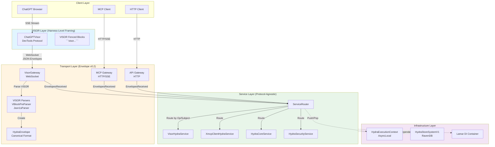

# 1. System Topology

## Overview

HYDRA is a protocol-agnostic service routing platform that connects multiple client types (ChatGPT, MCP clients, HTTP clients) to backend services through standardized message envelopes.

## Component Architecture



## Component Boundaries

### Edge Layer: VISOR (Harness-Level)
- **Responsibility:** Protocol-specific framing only
- **What it does:** Detects and emits fenced blocks (```visor ... ```)
- **What it doesn't do:** No routing, no batching, no business logic
- **Files:**
  - `ChatGPTVisor.cs` (896 lines)
  - `BrowserVisorAdapter.cs` (113 lines, dormant)

### Transport Layer: Gateways + Envelope
- **Responsibility:** Protocol normalization to canonical envelope
- **What crosses:** HydraEnvelope objects (JSON over WebSocket/HTTP)
- **What stays local:** CLR method calls, reflection-based routing
- **Files:**
  - `VisorGateway.cs` (384 lines)
  - `HydraMcpGateway.cs` (113 lines)
  - `HydraEnvelope.cs` (73 lines)
  - `VBlockPreParser.cs` (291 lines)
  - `Json1sParser.cs` (388 lines)

### Service Layer: Protocol-Agnostic
- **Responsibility:** Business logic execution
- **What it receives:** CLR parameters (strings, objects, JsonElement)
- **What it returns:** CLR objects (anonymous types, DTOs)
- **Files:**
  - `VisorHydraService.cs` (304 lines)
  - `XmcpClientHydraService.cs` (251 lines)
  - `HydraCoreService.cs` (varies)
  - `HydraSecurityService.cs` (169 lines + partials)

## Data Flow Across Boundaries

### Upstream (Client → Service)
```
User Input (Text)
  → VISOR Fenced Block (```visor\nmcp() { ... }\n```)
  → HydraEnvelope (JSON object)
  → CLR Method Parameters (Reflection)
  → Service Execution
```

### Downstream (Service → Client)
```
Service Return Value (CLR Object)
  → HydraEnvelope (JSON serialization)
  → WebSocket/HTTP Response
  → VISOR Fenced Block (ChatGPT only)
  → DOM Injection
```

## Key Design Principles

1. **Boundary Isolation:** VISOR knows nothing about envelopes, Services know nothing about VISOR
2. **Envelope Stops at Gateway:** Services never see HydraEnvelope, they see CLR parameters
3. **Protocol Agnostic Services:** Same service callable from VISOR, MCP, HTTP, or future protocols
4. **Evolvability:** Envelope is add-only, unknown fields ignored by parsers

## Physical Deployment

Gen1 V1 is single-process, single-machine:
- All components run in WPF application process
- WebSocket gateways on localhost:7777
- MCP gateway on localhost:5080
- Security service on localhost:5081/5444
- RavenDB embedded or localhost:8080

Gen2 will introduce distributed deployment with Akka.NET for location transparency.
