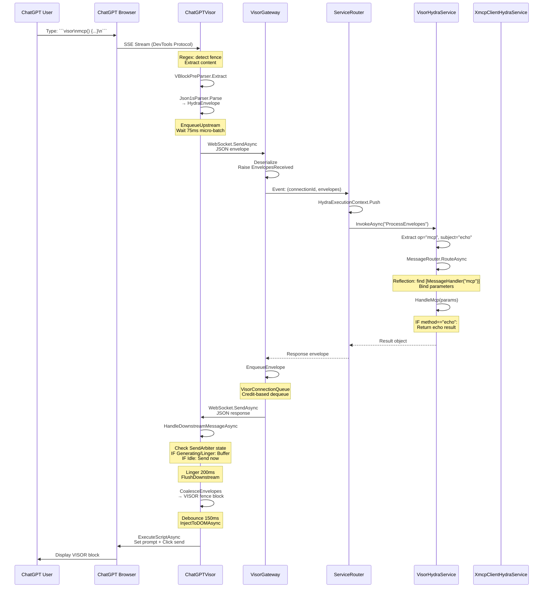

# 3. Complete Data Flow

This section traces the exact code paths for upstream (User → Service) and downstream (Service → User) flows with real line numbers and method calls.

## 3.1 Upstream: User → LLM → Gateway → Service

### Complete Call Chain

```
[1] User types in ChatGPT: ```visor\nmcp() { "name": "echo", "message": "Hello" }\n```
    ↓
[2] ChatGPTVisor.OnStreamResponseReceived (Line 267)
    File: /src/Hydra/Hydra.Server/Components/UI Dependent/Browser/Visor/ChatGPTVisor.cs
    Trigger: WebView2 DevTools Protocol event
    Params: requestId, url (must match /backend-api/f/conversation)
    ↓
[3] ChatGPTVisor.ProcessStreamChunk (Line 338)
    Params: sseChunk (Server-Sent Events text)
    Action: Extract message text from SSE JSON Patch format
    ↓
[4] Regex Match (Line 360)
    Pattern: @"```\s*visor\s*[\r\n]+(.*?)```"
    Extracts: VISOR fenced block content
    ↓
[5] VisorParsePipeline.ExtractAndParse (Line 374 of ChatGPTVisor, calls Line 21 of VisorParsePipeline.cs)
    File: /src/Hydra/Hydra.Server/Platform/Foundations/Visor Foundation/Parsing/VisorParsePipeline.cs
    Params: message (raw text with VISOR fences)
    ↓
[6] VBlockPreParser.Extract (Line 34 of VisorParsePipeline, calls Line 24 of VBlockPreParser.cs)
    File: /src/Hydra/Hydra.Server/Platform/Foundations/Visor Foundation/Parsing/VBlockPreParser.cs
    Returns: List<VBlock> where VBlock(string Prolog, string Body)
    Example: VBlock(Prolog: "mcp()", Body: "{ \"name\": \"echo\", \"message\": \"Hello\" }")
    ↓
[7] Json1sParser.Parse (Line 54 of VisorParsePipeline, calls Line 26 of Json1sParser.cs)
    File: /src/Hydra/Hydra.Server/Platform/Foundations/Visor Foundation/Parsing/Json1sParser.cs
    Params: vBlock.Prolog, vBlock.Body
    ↓
[8] Json1sParser.ParseSingleVCall (Line 152)
    Creates: HydraEnvelope object
    {
        Id: Guid.NewGuid().ToString(),
        Type: HydraEnvelopeType.call,
        Op: "mcp",
        Subject: "echo" (from payload.name),
        Payload: { "name": "echo", "message": "Hello" }
    }
    ↓
[9] ChatGPTVisor.EnqueueUpstream (Line 383 of ProcessStreamChunk, calls Line 563 of EnqueueUpstream)
    Action: Add envelopes to _upstreamQueue (thread-safe)
    ↓
[10] Timer Trigger: _microBatchTimer (75ms interval, Line 67)
     ChatGPTVisor.FlushUpstream (Line 576)
     Action: Drain queue and send batch
     ↓
[11] ChatGPTVisor.SendEnvelopeToGateway (Line 604)
     Serialize: JsonSerializer.Serialize(envelope, HydraEnvelope.JsonOptions) (Line 614)
     WebSocket: _gatewayWebSocket.SendAsync() (Line 620)
     URL: ws://localhost:7777/visor
     ↓
[12] VisorGateway.HandleWebSocketConnection (Line 169)
     File: /src/Hydra/Hydra.Server/Platform/Core Gateways/VisorGateway/VisorGateway.cs
     Action: Receive loop waits for WebSocket messages
     ↓
[13] WebSocket.ReceiveAsync (Line 190)
     Buffer: 8192 bytes
     Returns: message (JSON text)
     ↓
[14] VisorGateway.ProcessIncomingMessage (Line 235)
     Deserialize: JsonSerializer.Deserialize<HydraEnvelope>(message) (Line 254)
     Raise Event: EnvelopesReceived (Line 298)
     EventArgs: { ConnectionId, Envelopes }
     ↓
[15] App.xaml.cs Event Handler (Line 153)
     File: /src/Hydra/Hydra.Server/App.xaml.cs
     Get Service: container.GetInstance<VisorHydraService>() (Line 160)
     Prepare Params: parameters["envelopes"] = args.Envelopes (Line 166)
     ↓
[16] visorService.InvokeAsync("ProcessEnvelopes", parameters, context, cancellationToken) (Line 174)
     File: /src/Hydra/Hydra.Server/Platform/Core Services/VisorHydraService/VisorHydraService.cs
     Method: ProcessEnvelopes (Line 60)
     ↓
[17] VisorHydraService.ProcessSingleEnvelope (Line 111)
     Extract: op = "mcp", subject = "echo"
     Extract: parameters from Payload JsonElement
     ↓
[18] MessageRouter.RouteAsync (Line 47)
     File: /src/Hydra/Hydra.Server/Platform/Core Services/VisorHydraService/MessageRouter.cs
     Lookup: _handlers["mcp"] → HandleMcp method
     Bind Params: Match method parameters by name/type
     ↓
[19] method.Invoke(_target, args) (Line 103)
     Invokes: VisorHydraService.HandleMcp (Line 150)
     ↓
[20] VisorHydraService.HandleMcp (Line 150-262)
     Extract: method = "echo" (from payload.method or payload.name)
     Extract: message = "Hello" (from params["message"])
     Execute: Echo logic (Line 228-250)
     Return: { "echo": "Hello", "status": "success", "receivedAt": "...", ... }
```

### Key Transformations

| Step | Input | Output | File:Line |
|------|-------|--------|-----------|
| 1-4 | VISOR fenced text | Raw content string | ChatGPTVisor.cs:360 |
| 5-8 | Raw content | HydraEnvelope object | Json1sParser.cs:225 |
| 9-11 | HydraEnvelope | JSON bytes over WebSocket | ChatGPTVisor.cs:620 |
| 12-14 | JSON text | HydraEnvelope + Event | VisorGateway.cs:298 |
| 15-19 | HydraEnvelope | CLR method call | MessageRouter.cs:103 |
| 20 | CLR parameters | Service result object | VisorHydraService.cs:241 |

---

## 3.2 Downstream: Service → Gateway → LLM → User

### Complete Call Chain

```
[1] VisorHydraService.HandleMcp returns (Line 262)
    Return Value: { "echo": "Hello", "status": "success", "receivedAt": "...", ... }
    ↓
[2] App.xaml.cs Event Handler (Line 178-215)
    File: /src/Hydra/Hydra.Server/App.xaml.cs
    Create Envelope:
    new HydraEnvelope(
        Id: Guid.NewGuid(),
        Type: HydraEnvelopeType.@return,
        Corr: requestEnvelope.Id,
        Payload: JsonSerializer.SerializeToElement(new { requestId, result })
    )
    ↓
[3] visorGateway.EnqueueEnvelope(connectionId, responseEnvelope) (Line 212)
    File: /src/Hydra/Hydra.Server/Platform/Core Gateways/VisorGateway/VisorGateway.cs
    Method: EnqueueEnvelope (Line 147)
    ↓
[4] VisorConnectionQueue.TryEnqueue(envelope) (Line 154)
    File: /src/Hydra/Hydra.Server/Platform/Core Gateways/VisorGateway/VisorConnectionQueue.cs
    Method: TryEnqueue (Line 63)
    Action: Add to ConcurrentQueue (max size: 1000)
    ↓
[5] Background Task: VisorGateway.SendLoop (Line 318)
    Poll Interval: 10ms (Line 339)
    ↓
[6] VisorConnectionQueue.TryDequeue(out envelope) (Line 325)
    Method: TryDequeue (Line 80)
    Credit Check: _credit > 0 (Line 84)
    Credit Consume: _credit-- (Line 92)
    ↓
[7] VisorGateway.SendEnvelope (Line 327, calls Line 348)
    Serialize: _deterministicWriter.WriteAsync(envelope) (Line 354)
    Convert: Encoding.UTF8.GetBytes(json) (Line 355)
    ↓
[8] WebSocket.SendAsync (Line 357)
    Params: bytes, WebSocketMessageType.Text, endOfMessage: true
    ↓
[9] ChatGPTVisor.GatewayReceiveLoopAsync (Line 203)
    File: /src/Hydra/Hydra.Server/Components/UI Dependent/Browser/Visor/ChatGPTVisor.cs
    Receive: _gatewayWebSocket.ReceiveAsync(buffer) (Line 210)
    Buffer Size: 8192 bytes (Line 205)
    ↓
[10] ChatGPTVisor.HandleDownstreamMessageAsync (Line 638)
     Deserialize: JsonSerializer.Deserialize<HydraEnvelope>(message) (Line 645)
     Check State: _state (Idle/Generating/Linger)
     ↓
[11] State Machine Logic (Line 656-683)
     IF Generating: Add to _downstreamBuffer (Line 660)
     IF Linger: Add to _downstreamBuffer (Line 671)
     IF Idle: Send immediately (Line 682)
     ↓
[12] Linger State: Wait 200ms (Line 73: LingerDelayMs)
     Timer: _lingerTimer.Elapsed event
     ↓
[13] ChatGPTVisor.FlushDownstream (Line 708)
     Drain Buffer: batch = new List<HydraEnvelope>(_downstreamBuffer) (Line 720)
     Clear Buffer: _downstreamBuffer.Clear() (Line 721)
     ↓
[14] ChatGPTVisor.SendToLLMInputAsync (Line 740)
     Coalesce: coalescedMessage = CoalesceEnvelopes(batch) (Line 746)
     ↓
[15] ChatGPTVisor.CoalesceEnvelopes (Line 761)
     Build VISOR Block:
     ```VISOR
     response() { "echo": "Hello", "status": "success" };
     ```
     ↓
[16] ChatGPTVisor.DebouncedInjectToDOM (Line 820)
     Set: _pendingDomAction = () => InjectToDOMAsync(message).Wait() (Line 823)
     Timer: _domDebounceTimer (150ms, Line 82)
     ↓
[17] ChatGPTVisor.InjectToDOMAsync (Line 845)
     Delegate: _browser.SendPromptAsync(message) (Line 863)
     ↓
[18] ChatGPTFrontendClient.SendMessageAsync (Line 40)
     File: /src/Hydra/Hydra.Server/Components/UI Dependent/Browser/Programming Interfaces/ChatGPTFrontendClient.cs
     Set Prompt: ExecuteScriptAsync(GetSetPromptScript(prompt)) (Line 58)
     Wait: Task.Delay(1000) (Line 60)
     Click Send: ExecuteScriptAsync(GetSubmitScript()) (Line 63)
     Wait: Task.Delay(3000) (Line 65)
     Scroll: ExecuteScriptAsync(GetScrollToBottomScript()) (Line 68)
     ↓
[19] ChatGPT displays VISOR block in conversation
```

### Timing Breakdown

| Step | Component | Delay | Reason |
|------|-----------|-------|--------|
| 1-3 | Service → Gateway | <1ms | Synchronous, in-process |
| 4 | Queue Enqueue | <1ms | Non-blocking |
| 5-6 | SendLoop Poll | 10ms avg | Polling interval |
| 6 | Credit Check | <1ms | Lock-based |
| 7-8 | WebSocket Send | <5ms | Network I/O |
| 9-10 | Receive & Deserialize | <1ms | Async event-driven |
| 11-12 | Linger Buffer | **200ms** | State machine delay |
| 13-15 | Flush & Coalesce | <1ms | Synchronous |
| 16 | DOM Debounce | **150ms** | Prevent rapid DOM ops |
| 17-18 | DOM Injection | **~6s** | React delays (1s + 3s + 2s) |

**Total Latency:** ~6.4 seconds (dominated by DOM injection)

---

## 3.3 Critical Path Diagram



---

## 3.4 Echo Handler Round Trip (Concrete Example)

### Input Message
```visor
mcp(v="latest", c="json1s") {
  { "name": "echo", "params": { "message": "Hello from HYDRA" } }
}
```

### Upstream Transformations

**After VBlockPreParser (Line 96):**
```
VBlock(
  Prolog: "mcp(v=\"latest\", c=\"json1s\")",
  Body: "{ \"name\": \"echo\", \"params\": { \"message\": \"Hello from HYDRA\" } }"
)
```

**After Json1sParser (Line 225):**
```json
{
  "id": "a1b2c3d4-e5f6-7890-abcd-ef1234567890",
  "type": "call",
  "ts": "2025-11-10T12:34:56.789Z",
  "src": null,
  "dst": null,
  "op": "mcp",
  "subject": "echo",
  "corr": null,
  "trace": null,
  "auth": null,
  "caps": null,
  "qos": null,
  "flow": null,
  "schema": null,
  "content_type": null,
  "payload": {
    "name": "echo",
    "params": { "message": "Hello from HYDRA" }
  },
  "attachments": null,
  "error": null
}
```

**After HandleMcp (Line 241):**
```json
{
  "echo": "Hello from HYDRA",
  "receivedAt": "2025-11-10T12:34:57.123Z",
  "envelopeId": "a1b2c3d4-e5f6-7890-abcd-ef1234567890",
  "method": "echo",
  "status": "success"
}
```

### Downstream Transformations

**Response Envelope (App.xaml.cs Line 186):**
```json
{
  "id": "f0e1d2c3-b4a5-9687-1234-567890abcdef",
  "type": "return",
  "ts": "2025-11-10T12:34:57.125Z",
  "src": "VisorHydraService",
  "dst": "connection-guid-123",
  "op": "response",
  "subject": "mcp",
  "corr": "a1b2c3d4-e5f6-7890-abcd-ef1234567890",
  "payload": {
    "requestId": "a1b2c3d4-e5f6-7890-abcd-ef1234567890",
    "result": {
      "echo": "Hello from HYDRA",
      "receivedAt": "2025-11-10T12:34:57.123Z",
      "envelopeId": "a1b2c3d4-e5f6-7890-abcd-ef1234567890",
      "method": "echo",
      "status": "success"
    }
  }
}
```

**After CoalesceEnvelopes (Line 761):**
```
```VISOR
response() { "echo": "Hello from HYDRA", "receivedAt": "2025-11-10T12:34:57.123Z", "envelopeId": "a1b2c3d4-e5f6-7890-abcd-ef1234567890", "method": "echo", "status": "success" };
```
```

**Final Display:** ChatGPT renders the VISOR block in the conversation, showing the echoed message.
